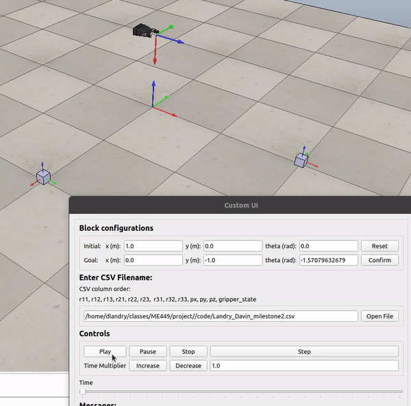

# Davin Landry ME449 Final Project

## Objective
The goal for this project is to create a code that outputs configuration arrays that are used to manipulate the kuka youbot robot in coppeliasim.
The robot trajectory is to complete a pick and place task on a cube. To do this, the project has been split into 3 parts.

Milestone 1 is to create a function (NextState) that simulates the kinematics of the youbot, incorporating the dynamics of the 5 joint arm and the 4 mecanum wheels. 

Milestone 2 is to make a function (TrajectoryGenerator) that creates a desired trajectory for the end effector that follows the path to pickup and place the cube from one point to another.

Milestone 3 is to create a feedforawrd control function (FeedbackControl) that uses kinematic task-space feedforward and feedback control law. This outputs the joint speeds for the robot to follow and keep up with the end effectors trajectory.

The final code for the project incorporates all of these milestone elements to simulate the robots kinematics to complete the pick and place task.

## Code
It uses the end effector trajectory from milestone 2 to perform a feedforward trajectory planning for the configuration of the whole youbot robot.
By manipulating the initial configuration and the Kp and Ki values of the controller the simulated robot will have different results when completing the task.
The code creates a csv file of the configuration array to perform the trajectory in coppelia sim. 

## Deliverables and Results
There are three senarios that need to be demonstrated and analysed. The task is to tune the proportional and integral controller to sample different dynamics when the end effector is initially configured in a position that is offset from the starting position of the desired end effector trajectory specified from milestone 2. 

All three senarios will have directories that will have the configuration csv file, a graph of the Xerror values through the trajectory, a readme file to describe the configuration  variable values used, and a video of the coppelia simulation.
### Best
The Best senario is when the proportional and integral controllers are tuned in a way that eliminates error quickly and without overshoot to complete the simulated pick and place task. The error values should converge to zero by the time the robot completes the first trajectory segment.

### Overshoot
The overshoot senario is when the controller and initial configuration is tuned to demonstrate an overshoot result of the Xerror values. The error values should still converge and the robot should still be able to complete the pick and place task.

### New Task
The new task senario is to demonstrate the pick and place task with a new set of initial and final positions of the cube. The controllers for this senario can be tuned to make the robot complete the task effectivly. 

